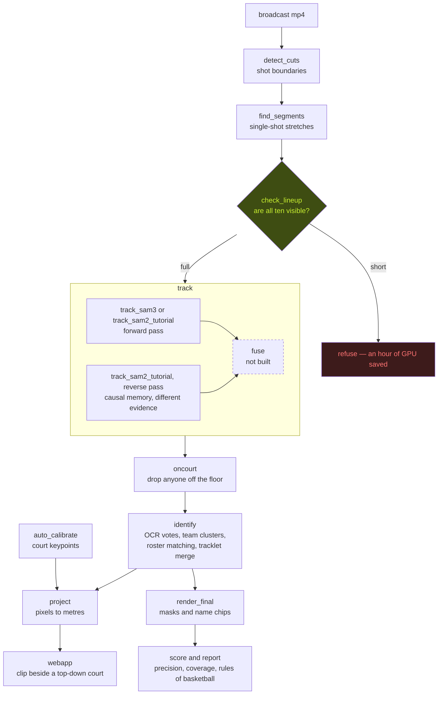
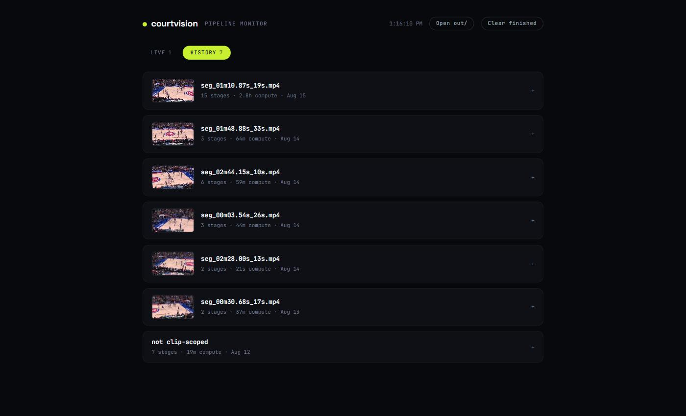

# courtvision

Give it a broadcast of a basketball game. It returns who is on the floor, where
they are standing in metres, and which club they play for — from the television
picture alone, with no fixed camera and no instrumented arena.

Currently: five single-shot segments from NYK @ DET, game 4 of the 2025 East
first round, 10 to 33 seconds each. Four carry hand-read ground truth. On the
best two, every label drawn is on the right man, on every frame.



The gate is the part worth noticing: it is cheap, it is early, and it is the
only place the pipeline is allowed to refuse.

## What it actually does, and what that cost

Every number below was measured on this footage by the scripts in `pipeline/`,
not quoted from a paper or a vendor page. Where something has not been
measured, it says so.

| stage | measured |
|---|---|
| Player detection, per frame | 10 of 10 players on **52%** of frames — the rest of the time somebody is genuinely off camera |
| Jersey-number regions | **precision 95.7%, recall 82.2%** against 30 hand-labelled frames (163 boxes) |
| Court projection | **88 of 88** sampled frames solved, 10–12 landmarks found where 4 are needed |
| Identity, per drawn label | **precision 100%** on three of four labelled segments — the name on screen is on the right man |
| Identity, per player on court | **coverage 91.7–100%** on those three; the shortfall is players nobody could name, not players named wrongly |

Precision and coverage are measured by `pipeline/score.py`, which replays the
renderer's own drawing rule against a per-track ground truth. Every labelled
segment, worst first:

| segment | route | precision | coverage | wrong frames |
|---|---|---|---|---|
| seg_01m10.87s_19s | SAM2, prompt once | 95.5% | 84.2% | 462 |
| seg_01m10.87s_19s | SAM3 + on-court filter + merge | **100.0%** | 91.7% | 0 |
| seg_02m44.15s_10s | SAM3 | **100.0%** | 99.8% | 0 |
| seg_02m28.00s_13s | SAM3 | **100.0%** | **100.0%** | 0 |

Two different comparisons live in that table and are worth keeping apart.
Across the two 19-second rows only the route changes — same footage, same
scorer — and that is where precision moves. Across the three SAM3 rows only
the footage changes: 10s and 13s both come in at essentially 100% while the
19s clip drops to 91.7%, and the unlabelled 33-second segment loses two
players for fifteen seconds.

Length is the suspect, not the proven cause. Three clips do not establish a
curve, and the 13-second one outscores the 10-second one. What the 19s and 33s
clips have in common is sustained contact between players; the two short ones
have none. Contact is the mechanism — a track that has to be re-acquired can
be re-acquired as somebody else — and longer clips simply meet more of it.

Two caveats stated before you ask. Four segments is a small sample, and the
ground truth was read off crop strips by eye by the author — the same person
whose system it scores. Stretches too blurred to read are marked unknown and
skipped rather than guessed, which is why coverage has a ceiling below 100%
on the longer clips.

### What it costs

Taken from the run archive rather than estimated — every stage reports its own
wall clock to `out/progress/`, on one RTX 4080, for the 19-second segment.
Runs are matched to the artefact they produced, so these are the stages of one
route and not the fastest of each job.

| route | tracking | identity | render | total | ×realtime | a 48-min game |
|---|---|---|---|---|---|---|
| SAM3 + on-court filter | 47.9m | 38.8m | 2.4m | **89.6m** | 279× | **223 GPU-hours** |
| fused, two SAM2 passes | 24.5m | 32.0m\* | 2.5m | **59.0m** | 184× | **147 GPU-hours** |
| SAM2, prompt once | 11.4m | 16.0m\* | 2.4m | **29.8m** | 93× | **74 GPU-hours** |

\* the forward pass's identify predates the archive; the reverse pass's run is
used as a like-for-like proxy. Everything else is an archived run tied to the
file it wrote.

Two things in that table were not obvious before it existed.

Identity is not the cheap stage. On the SAM3 route it is 43% of the bill,
because SAM3 fragments the clip into 189 track ids and every one of them gets
its crops read. The SAM2 pass produces about a dozen tracks and its identify
costs 16 minutes against 38.8. Tracking is the headline cost, but the tracker
sets the identity cost too, and it does so through a number nobody looks at.

Running the clip twice is cheaper than running SAM3 once — 59.0m against
89.6m, because two SAM2 passes plus two identify runs still come in under one
SAM3 pass plus its fragmented identify. Whether it is also as accurate is the
open question: the fused route is deliberately absent from the accuracy table
above, because a gate aimed at the one track it currently gets wrong is still
being written. It goes in the table when it stops moving, with the number it
lands on rather than the number it is passing through.

Nothing here is optimised for throughput, and it would not be honest to imply
otherwise. The obvious moves are unmade: identity runs OCR on a grid of frames
where a track's number is settled by its first dozen legible reads, tracking
runs at source resolution, and nothing is batched across segments. A
production version would also not run this on all 48 minutes — most of a
broadcast is not live play, and `find_segments.py` already knows which parts
are.

## The interesting part

Not the models. All five are off the shelf. What took the time was finding out
which of the pipeline's own assumptions were wrong.

**The tracker only asks once.** SAM2 takes its prompts on frame 0 and
propagates from there, so the set of players it can ever identify is fixed by a
single detection call. On this broadcast only about half of all frames show all
ten players, and the camera cuts every 8.8 seconds — so a longer clip is not
more data, it is more chances to be holding the wrong ten people. Eight-second
single-shot segments are not a demo shortcut; they are the regime the
architecture actually supports.

**The roster is a constraint, not a lookup table.** One number belongs to one
player. Deciding each track independently throws that away and produces two
players wearing #0. Solving a club's tracks together — maximum-weight matching
between tracks and the club's numbers, weighted by OCR votes — recovers
readings that independent voting refuses: a track tied 13–13 between #25 and #8
resolves to #25 once #8 is taken by a track with twice the evidence.

**Gates belong at the front.** The pipeline's checks were all at the end, where
a bad result is cheap. Three runs of roughly an hour each were decided by a
detection call in minute two and only discovered at the final render. The fix
was not a model: count the lineup on the prompt frame and refuse to continue
when it is short. Its first run repaid itself by revealing that the segment had
never been the problem — the prompts were coming from the wrong detector.

**The first real metric reversed a decision I had already made.** Before
`score.py` existed, the two tracking routes were ranked by the share of frames
showing all ten labels: SAM2 62%, SAM3 50%. SAM2 won and the pipeline was
built on it. That proxy counts labels without checking them, and it was
wrong — measured against ground truth, SAM2 scores 95.5% precision to SAM3's
100%, and every one of its 462 wrong frames is a single track that is Harris
for four seconds and Towns afterwards while the render calls it Harris
throughout. Two fifths of that clip carried Harris's name on Towns. It had
survived two days of frames cropped and checked by hand, including the check
that asked "are Towns and Harris both labelled at 15s?" — they were, and one
of the labels was on the wrong man. Counting labels cannot see that; only
checking them can.

The proxy still earns its keep, now that its ceiling is known: `report.py`
grades a segment with no ground truth at all, using rules that need none — ten
on the floor, five a side, one man one identity, one identity one label. It
shortlists; `score.py` decides. On the 26-second clip the rules alone return a
verdict in a second: four Pistons named, not five.

## Stack

| | |
|---|---|
| Detection | RF-DETR (`basketball-player-detection-3-ycjdo/4`) — players, jersey-number regions, referees, rim, ball |
| Tracking | SAM2 (`sam2.1_hiera_large`) through `segment-anything-2-real-time` |
| Teams | SigLIP embeddings → UMAP → K-means, no labelling |
| Numbers | SmolVLM2 LoRA (`basketball-jersey-numbers-ocr/7`), aggregated over a track. The notebook pins v3; v7 replaces it on a same-conditions comparison — its base is the 2.2B rather than the 256M, and the one systematic misread on this footage disappears |
| Court | `basketball-court-detection-2/14` keypoints → `ViewTransformer` → NBA court plan from `sports.basketball` |
| Front end | Next.js on port 3100, playing the clip beside a live top-down court |

This follows [Roboflow's basketball notebook](https://blog.roboflow.com/identify-basketball-players/)
component for component. Where this repo deviates, the deviation was measured
against the original on the same footage — see `docs/tracking-comparison.md`.

## What was tried and rejected

Kept here because a negative result that is not written down gets paid for
twice.

- **Fine-tuning the number detector on our own labels.** 150 frames labelled by
  hand, split by game time, scored before and after. It got worse: precision
  95.7% → 68.0%, false positives 6 → 57. 101 training frames against the 13
  games behind the base weights. The base detector stayed.
- **Filtering unreadable crops with signals we already had** — box size,
  detector confidence, Laplacian sharpness. None separates a correct read from
  a wrong one; a threshold on confidence drops 25 bad reads and loses 26 good
  ones. Doing this properly needs a trained legibility classifier.
- **Deep-EIoU**, which an earlier version of this file recommended on SportsMOT
  numbers. Never implemented. The tutorial designates SAM2 and this repo
  follows the designated baseline, so the comparison was never run and the
  claim has been removed rather than left standing unearned.

## Known limits

- **Seconds, not a game, and it decays inside a segment too.** Identity does
  not survive a camera cut, and this broadcast cuts every 8.8 seconds on
  average. Within a single shot it still decays with length: coverage runs
  100% at 13s, 91.7% at 19s, and the 33-second segment loses two players to a
  fifteen-second collapse — nearly half the clip. Longer clips contain more
  contact, and a track that has to be re-acquired can be re-acquired as
  somebody else. The route to a full game is in `docs/tracking-comparison.md`:
  segment at cut boundaries, re-prompt each segment, stitch identities across
  them by jersey number. Not built.
- **No event detection.** No shots, rebounds, assists or made/missed.
  `ShotEventTracker` ships in `sports@feat/basketball` and has never been run
  here. The event list on the homepage is placeholder and labelled as such.
- **No ball tracking.** Small, fast, heavily occluded — a different problem.
- **No HOTA, no IDF1, and that is a choice.** Identity is measured end to end —
  is the name drawn on screen on the right man — rather than as tracker
  continuity. A tracker that fragments a player into three tracks scores badly
  on IDF1 and perfectly here if all three carry his name, which is what the
  product actually claims. The trade is that these numbers cannot be compared
  against a tracking leaderboard.
- **Four labelled segments, self-labelled.** The truth files were read off crop
  strips by eye by the author. No second annotator, no inter-annotator
  agreement, and the sample is four clips from one game.
- **One game, one broadcaster.** Nothing here has been tried on another arena,
  another camera crew, or another league.

`docs/gap-analysis.md` holds the full version of this, stage by stage.

## Run it

The models need a GPU-sized environment, kept outside the repo:

```bash
python -m venv ~/.venvs/courtvision
~/.venvs/courtvision/Scripts/pip install torch torchvision --index-url https://download.pytorch.org/whl/cu124
~/.venvs/courtvision/Scripts/pip install rfdetr supervision inference onnxruntime-gpu ultralytics \
    "git+https://github.com/roboflow/sports.git@feat/basketball" "supervision==0.27.0"
```

Then, gate first — it costs two minutes and decides the ceiling of everything
after it:

```bash
python pipeline/check_lineup.py --video web/media/demo.mp4 --render out/lineup.jpg
python pipeline/detect_cuts.py  --video web/media/demo.mp4
python pipeline/track_sam2_tutorial.py --video web/media/demo.mp4 --out out/tracks.json
python pipeline/identify.py --video web/media/demo.mp4 --boxes out/tracks.json \
    --rosters web/data/rosters_det.json --out out/identities.json --confirm roster
python pipeline/render_final.py --video web/media/demo.mp4 --boxes out/tracks.json \
    --identities out/identities.json --out out/final.mp4
python pipeline/project_tutorial.py --video web/media/demo.mp4 --boxes out/tracks.json \
    --identities out/identities.json --out web/data/nba.json
```

Long runs report to files rather than a terminal buffer —
`python pipeline/progress.py --serve`, then http://localhost:8799. A two-and-a-
half hour SAM2 run once produced no visible output at all because ultralytics
buffered every result; progress belongs in files.



Finished runs are kept, not cleared, and grouped by the clip they were run on:
one row per segment, its stages folded underneath in the order they ran, each
carrying what it produced, the parameters it used and the commit that produced
it. The compute figures quoted above were read off this, not estimated. A run
that crashes is archived as failed with its traceback — before this, a crashed
script simply stopped writing and sat on the page as "stale" forever.

The tests are the identity rules, pinned to the clips that produced them:

```bash
~/.venvs/courtvision/Scripts/python -m pytest tests -q
```

Each one is a defect this pipeline shipped — a seven-frame tracker handover
that lost a player, a clipped crop that read `25` as `5`, `#8` belonging to a
different man on each roster. They were prose in a docstring, and prose does
not fail when someone widens a threshold.

The front end:

```bash
cd webapp && npx next dev -p 3100
```

`web/media/` and `web/data/` are the sources of truth; `webapp/public/{media,data}`
are junctions to them.

### Three Windows traps

Each reports something a long way from its cause.

- `rfdetr[train]` pulls in `opencv-python-headless`, which ships the same `cv2`
  module as `opencv-python` and wins by installing second. Everything keeps
  working until `calibrate.py` opens a window and OpenCV says it was built
  without GUI support. Uninstall the headless build and reinstall
  `opencv-python` — a superset, so training dependencies are satisfied either way.
- `inference` defaults its model cache to `/tmp/cache`, which on Windows
  produces `/tmp/cache\lora-bases/...` and a complaint from transformers about
  a malformed HuggingFace repo id. `config.inference_env()` sets
  `MODEL_CACHE_DIR` before the import — along with `ONNXRUNTIME_EXECUTION_PROVIDERS`,
  without which every model runs on CPU. Setting it after the import is
  silently ignored, and it only works with `onnxruntime-gpu` installed in place
  of `onnxruntime`. Measured: identify goes from 30 minutes to 9.5.
- The same package unpacks the OCR model's LoRA base into a *flattened*
  directory — `~lora-bases-smolvlm2-...-<hash>` — then reads it back from a
  nested path. The weights download fine and the load still fails, again as a
  repo-id error. The path differs by base: v3 wants
  `lora-bases/smolvlm2/smolvlm-256m/main`, v7 wants `lora-bases/smolvlm2/main`.
  Link the flattened directory to where it is looked for — a junction rather
  than a copy, since the 2.2B base is 12.6GB:

  ```powershell
  $c = "$HOME\.cache\inference"
  # v7 (2.2B, the default)
  $src = (Get-ChildItem $c -Directory -Filter "~lora-bases-smolvlm2-main-*")[0].FullName
  $dst = "$c\lora-bases\smolvlm2\main"
  # v3 (256M) would be ~lora-bases-smolvlm2-smolvlm-256m-main-* into
  #   $c\lora-bases\smolvlm2\smolvlm-256m\main
  New-Item -ItemType Directory -Force (Split-Path $dst)
  New-Item -ItemType Junction -Path $dst -Target $src
  ```

Clips must be written **faststart** or the browser cannot begin playback until
it has the whole file:

```bash
ffmpeg -i raw.mp4 -c copy -movflags +faststart web/media/nba.mp4
```

## Status

Experimental, and scoped on purpose. The box score on the homepage is the real
ESPN line for this game; the shot-zone split is illustrative and adds back to
the real field-goal totals; the event list is placeholder. Anything not
measured says so.
